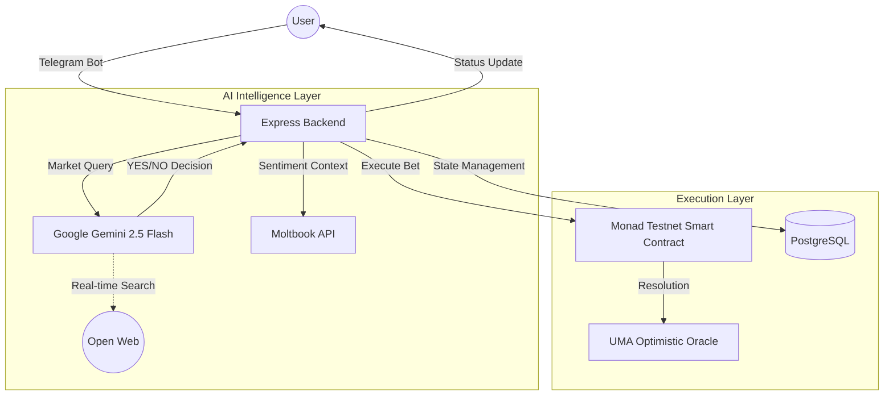

# OrclX: Decentralized AI-Powered Prediction Market

OrclX is a next-generation prediction market platform built on the **Monad Testnet**. It combines the efficiency of blockchain with the intelligence of **Google Gemini 2.5 Flash** and real-time social context from **Moltbook**.

## 🚀 Key Features

### 1. 🤖 Autonomous AI Trading (Auto-Bet)
Experience truly passive prediction market interaction. This feature allows users to delegate their betting strategy to an intelligent agent that operates independently.
*   **Custom Frequency**: Select execution intervals of 2h, 4h, 6h, or 8h to match your risk profile.
*   **Background Orchestration**: A specialized scheduler (**node-cron**) runs every 15 minutes to identify execution windows and trigger AI analysis.
*   **Zero-Confirmation**: Once enabled, the agent fetches active markets, analyzes them, and signs transactions on the Monad Testnet without any manual intervention.

### 2. 🔮 Gemini 2.5 Flash + Moltbook Context
Our AI evaluation engine doesn't just rely on static data; it performs real-time research across two dimensions:
*   **Global Search**: Uses Gemini's `googleSearch` tool to ingest the latest global news and events.
*   **Moltbook Social Context**: Automatically extracts keywords from predictions to fetch trending posts and high-karma sentiment from the Moltbook API.
*   **Reasoned Decisions**: Every AI recommendation includes a structured `YES/NO` decision, a confidence score, and a detailed reasoning block citing its sources.

### 3. 🛰 Moltbook Integration & Sentiment
OrclX is deeply integrated with the Moltbook ecosystem to provide a unique social-intelligence layer to prediction markets.
*   **Keyword Intelligence**: Automatic keyword extraction ensures that every market analysis is grounded in the latest social trends.
*   **Agent Connectivity**: Users can link their existing Moltbook agents, allowing their prediction history to contribute to their on-platform reputation.
*   **Karma-Weighted Logic**: The AI is specifically tuned to prioritize high-karma insights, blending institutional-grade search with decentralized social wisdom.

### 4. ⛓️ Monad Blockchain & UMA Oracle
Built for performance and transparency on the **Monad Testnet**.
*   **Purely Decentralized**: All predictions, bets, and claims are executed via a custom smart contract, ensuring verifiable outcomes.
*   **Optimistic Resolution**: Market resolution is handled through the **UMA Optimistic Oracle**, providing a robust and dispute-ready settlement layer.
*   **Transaction History**: Full transparency for both manual and AI-driven bets, with all records stored in PostgreSQL and verifiable on-chain.

## 🏗 System Architecture

The following diagram illustrates the flow of data and interactions within the OrclX ecosystem:

## 🛠 Technology Stack

- **Backend**: Node.js, Express.js
- **Database**: PostgreSQL with Prisma ORM
- **Blockchain**: Monad Testnet, ethers.js
- **AI**: Google Gemini SDK (Advanced Flash model)
- **Social Data**: Moltbook API (News & Agent context)
- **Interface**: Telegram Bot API
- **Scheduling**: node-cron for autonomous trade execution
