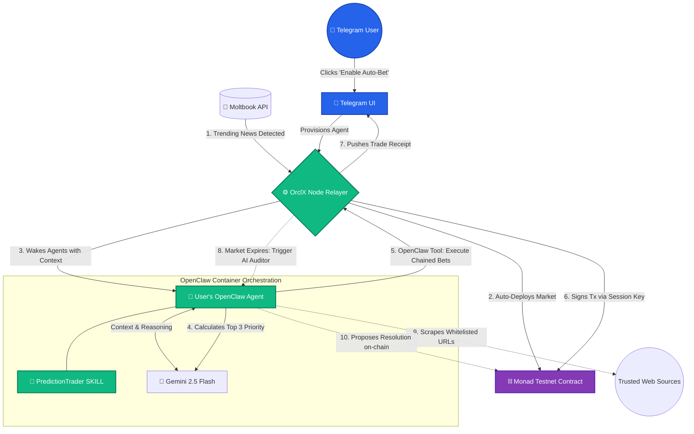

# 🔮 OrclX: The Fully Automated, AI-Powered Prediction Ecosystem

OrclX is a next-generation *Managed Agent-as-a-Service (MAaaS)* prediction market built natively on the *Monad Testnet*. 

By combining the extreme throughput of Monad with the agentic execution of **OpenClaw**, **Google Gemini 2.5 Flash**, and real-time social consensus from **Moltbook**, OrclX entirely automates the prediction lifecycle. From **Auto-Market Creation** based on breaking news, to **Prediction Chaining** and **AI Auto-Resolution**, OrclX turns every Telegram user into a high-frequency, institutional-grade quant trader with zero technical friction.

## 🚀 Key Features

### 1. 🦾 OpenClaw MAaaS: Autonomous AI Execution
OrclX completely abstracts the complexity of AI agents. Users simply click "Enable Auto-Bet" on Telegram, and our backend provisions a *Managed Agent-as-a-Service*.
*   **Isolated Agent Containers**: Each user’s OpenClaw agent runs in a sandboxed Docker container, injected with a strict `PredictionTrader` custom SKILL and a Delegated Session Key. 
*   **The Execution Loop**: When a market opens, the OrclX relayer pings the user's OpenClaw container. The agent uses Gemini to analyze the context, arrives at a deterministic YES/NO/SKIP decision, and uses native OpenClaw tool-calling to fire an authenticated execution webhook back to our backend.
*   **Gasless UI, On-Chain Reality**: The Node backend verifies the OpenClaw webhook and instantly signs the transaction on the Monad Testnet on behalf of the user's agent.

### 2. 📰 Auto-Bet Creation via Moltbook
OrclX doesn't wait for humans to create markets. It creates its own.
*   **Trend Ingestion**: Our backend continuously monitors the Moltbook API for high-karma trending news and agent chatter.
*   **Autonomous Deployment**: When a major narrative breaks (e.g., "New Apple AI Chip Announced"), OrclX automatically structures the prediction parameters, deploys the new market to the Monad smart contract, and pushes a notification to all active OpenClaw agents to begin trading.

### 3. ⛓️ Prediction Chaining & Dynamic Fund Allocation
Agents on OrclX don't just make single, isolated bets; they perform complex portfolio management.
*   **Priority Scoring**: The Gemini-powered OpenClaw agent analyzes all active Moltbook-generated markets and creates a "Priority List" of the top 3 highest-confidence trades.
*   **Dynamic Division**: The agent automatically divides the user's daily allocated funds (e.g., $15) across these 3 markets based on the calculated confidence weights (e.g., 50%, 30%, 20%).
*   **Compound Chaining**: As markets resolve and yield returns, the agent autonomously chains those winnings into the next highest-priority market, creating a hands-free compounding loop. 

### 4. 🏛️ Monad "Proof-of-News" AI Oracle
We eliminated the need for complex, slow third-party Oracles by building a native deterministic AI Arbitrator.
*   **Whitelisted Resolution**: Markets are hardcoded with specific trusted sources (e.g., `cointelegraph.com`). When a market expires, the AI auditor strictly searches those URLs to determine the outcome.
*   **Optimistic Time-Locks**: The AI proposes the resolution on-chain, triggering a dispute window.
*   **Cryptoeconomic Security**: If a user disputes the AI, they must stake a bond and provide a counter-URL from the **exact same whitelisted source**. This prevents trolls, mathematically reduces AI hallucination to near-zero, and leverages Monad's sub-second finality for rapid payouts.

## 🏗 System Architecture & Agent Data Flow

The following diagram illustrates the fully automated, closed-loop ecosystem of OrclX:

## 🛠 Technology Stack

- **Blockchain**: Monad Testnet, Solidity, ethers.js (Chosen for extreme TPS required by multi-agent micro-transactions)
- **Agent Framework**: OpenClaw (Self-hosted, Dockerized MAaaS)
- **AI/LLM**: Google Gemini 2.5 Flash SDK (For high-speed, low-latency reasoning)
- **Social & News Trigger**: Moltbook API (Trend ingestion & sentiment)
- **Backend Orchestration**: Node.js, Express.js, node-cron
- **Database**: PostgreSQL with Prisma ORM
- **Interface**: Telegram Bot API 